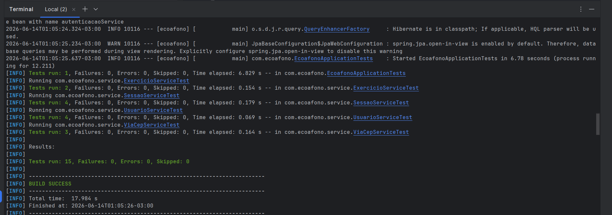
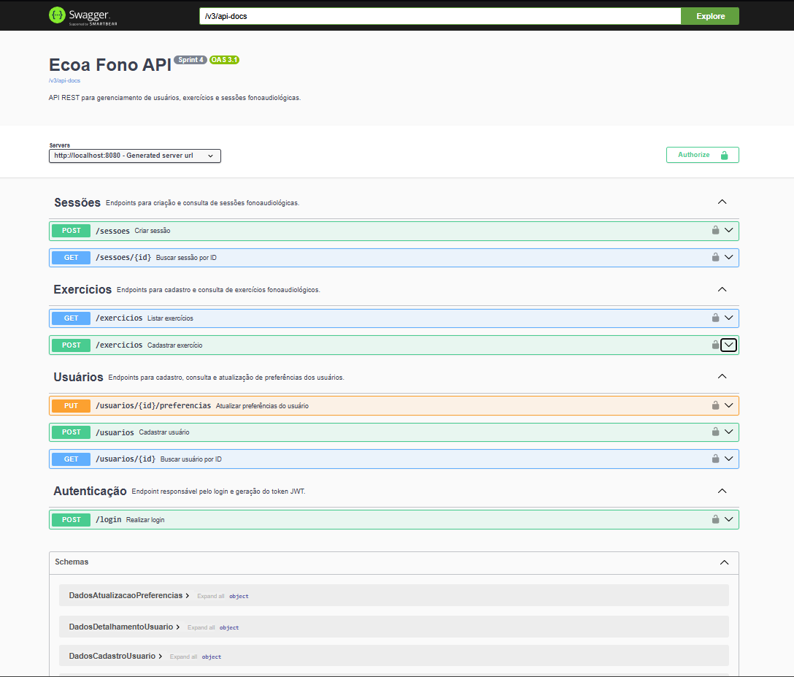
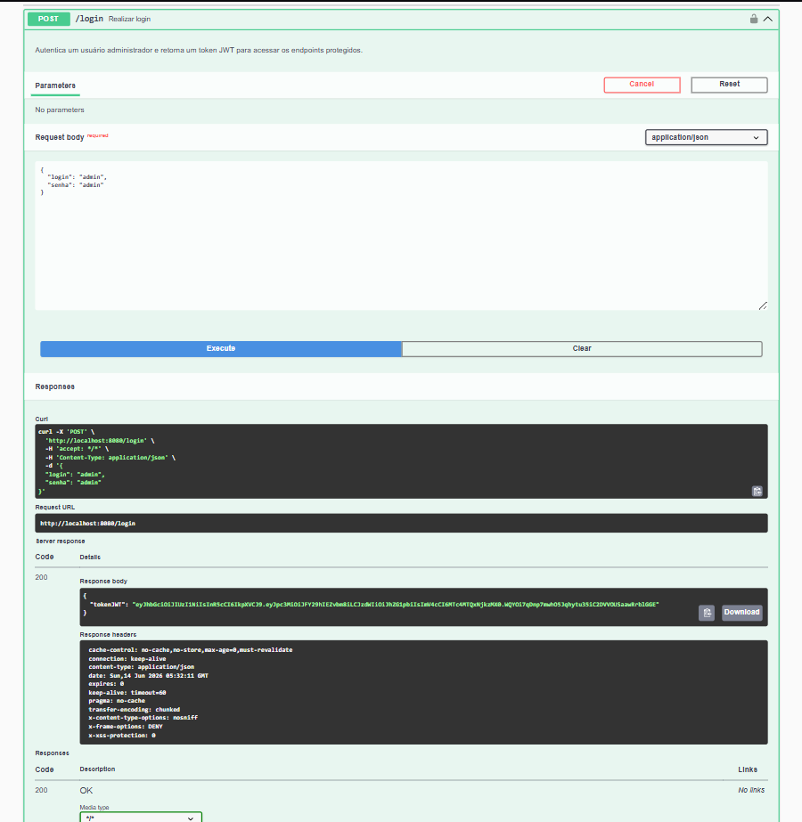

# Ecoa Fono

## Integrantes

- André de Sousa Neves – RM 553515
- Caio Sato Tominaga – RM 553633
- Eduardo Brites Coutinho – RM 552943
- Isabela Barcellos – RM 553746
- Thaís Gonçalves Leoncio – RM 553892

---

# Descrição do Projeto

O Ecoa Fono é uma API REST desenvolvida para a disciplina de Arquitetura Orientada a Serviços e Web Services.

O sistema tem como objetivo recomendar exercícios fonoaudiológicos personalizados de acordo com a faixa etária e o objetivo informado pelo usuário.

A aplicação utiliza arquitetura em camadas, banco de dados MySQL, autenticação JWT, criptografia BCrypt e integração com a API ViaCEP para preenchimento automático de endereço.

---

# Tecnologias Utilizadas

- Java 22
- Spring Boot 3.5.6
- Spring Data JPA
- Spring Security
- JWT
- BCrypt
- MySQL
- Flyway
- Maven
- Lombok
- SpringDoc OpenAPI (Swagger)
- ViaCEP API

---

# Funcionalidades

## Usuários

- Cadastro de usuários
- Consulta de usuário por ID
- Atualização de preferências

## Exercícios

- Cadastro de exercícios
- Listagem de exercícios

## Sessões

- Criação de sessões personalizadas
- Consulta de sessão por ID

## Segurança

- Login com JWT
- Controle de acesso por perfil ADMIN
- Senhas criptografadas com BCrypt

## Integração Externa

- Consulta automática de endereço via ViaCEP

---

# Arquitetura

```text
Cliente
   │
   ▼
Controller
   │
   ▼
Service
   │
   ├── ViaCEP API
   │
   ▼
Repository
   │
   ▼
MySQL
```

---

# Banco de Dados

```sql
CREATE DATABASE ecoa_fono;
```

---

# Endpoints

## Autenticação

```http
POST /login
```

## Usuários

```http
POST /usuarios
GET /usuarios/{id}
PUT /usuarios/{id}/preferencias
```

## Exercícios

```http
POST /exercicios
GET /exercicios
```

## Sessões

```http
POST /sessoes
GET /sessoes/{id}
```

---

# Como Executar

## Clonar o projeto

```bash
git clone <repositorio>
```

## Configurar banco

```properties
spring.datasource.url=jdbc:mysql://localhost/ecoa_fono
spring.datasource.username=root
spring.datasource.password=sua_senha
```

## Executar

```bash
./mvnw spring-boot:run
```

## Swagger

```text
http://localhost:8080/swagger-ui/index.html
```

---

# Autenticação

Realizar login utilizando:

```json
{
  "login": "admin",
  "senha": "admin"
}
```

O sistema retornará um token JWT utilizado nos endpoints protegidos.

---

# Evidências

## Testes Automatizados



## Swagger



## Login



## Validação de Segurança

### Falha de autenticação


### Realizando autenticação


### Token gerado


## CEP Inválido


## Cadastro de Usuário


## Consulta de Usuário


## Atualização de Preferências


## Cadastro de Exercício


## Consulta de Exercícios


## Criação de Sessão


## Consulta de Sessão


---

# Integração Externa

API utilizada:

```text
https://viacep.com.br/ws/{cep}/json/
```

O endereço do usuário é preenchido automaticamente durante o cadastro a partir do CEP informado.

